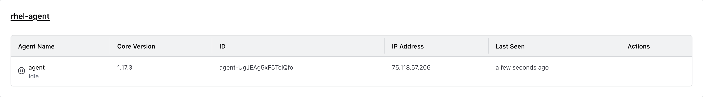

> Just to note, this is not an official solution. Just side I did as an example. 

This comes up frequently and there were no readily available or supported agent images which run on RHEL exclusively. 

All work done here is essentially the recommended steps installing the agent directly on the server. 

https://developer.hashicorp.com/terraform/cloud-docs/agents/requirements 
https://developer.hashicorp.com/terraform/cloud-docs/agents/agents

## Gist of It

 This Containerfile creates an image for running the Terraform Cloud Agent using RedHat UBI 9.

 Base Image:
 - Uses the latest Red Hat Universal Base Image 9 (ubi9).

 Arguments:
 - AGENT_VERSION: The version of the Terraform Agent to install (default: 1.17.3).

 Steps:
 1. Create a system group and user named 'tfc-agent' to run the agent.
 2. Install required software packages: git, wget, jq, unzip, tar, gzip.
 3. Download the specified version of the Terraform Cloud Agent.
 4. Unzip the downloaded agent into the home directory of the 'tfc-agent' user.
 5. Set appropriate permissions for the 'tfc-agent' user.
 6. Clean up the downloaded zip file.
 7. Set the container to run as the 'tfc-agent' user.
 8. Set the working directory to the home directory of the 'tfc-agent' user.
 9. Define the entrypoint to run the Terraform Cloud Agent.

## Building

This will work with either Docker or Podman. If you want it RedHat all the way down, then Podman would be the choice. 

## Running

Export the Agent Token and Agent Name:

```
export TFC_AGENT_TOKEN=r9VF4xv9cV5nFQ.atlasv1.yesThisisaFakeTokeN
export TFC_AGENT_NAME=rhel-agent
```

For Docker, replace `[image]` with your image:

```
docker run -e TFC_AGENT_TOKEN -e TFC_AGENT_NAME [image]:latest
```

For Podman, replace `[image]` with your image:

```
podman run -e TFC_AGENT_TOKEN -e TFC_AGENT_NAME [image]:latest
```

Output: 

```
➜  tf-agent-rhel git:(main) ✗ podman run -e TFC_AGENT_TOKEN -e TFC_AGENT_NAME rhel-tf-agent:latest
2024-12-12T19:40:10.239Z [INFO]  agent: Starting: agent_name=agent agent_version=1.17.3
2024-12-12T19:40:10.335Z [INFO]  core: Starting: version=1.17.3
2024-12-12T19:40:10.680Z [INFO]  core: Agent registered successfully with HCP Terraform: agent_id=agent-UgJEAg5xF5TciQfo agent_pool_id=apool-ADsRY2QP68nLQw8Z
2024-12-12T19:40:10.966Z [INFO]  agent: Core version is up to date: version=1.17.3
2024-12-12T19:40:10.966Z [INFO]  core: Waiting for next job
```

In HCP Terraform:

